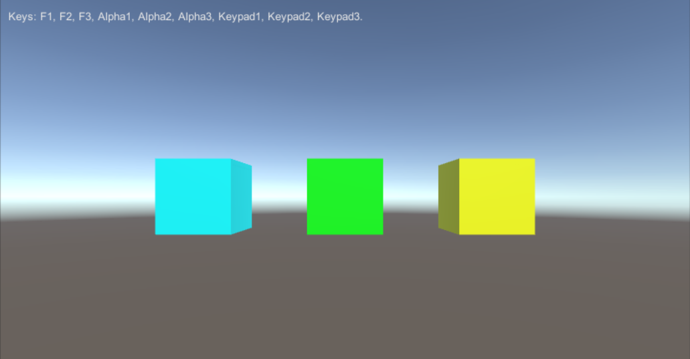

# MGS-CommandServo

## Summary
- Command servo system for Unity project.

## Environment
- Unity 5.0 or above.

- .Net Framework 3.0 or above.

## Platform
- WindowsPlayer.
- Android.

## Achieve
- Ignore

## Demo
- Demos in the path "MGS-CommandServo/Scenes" provide reference to you.

## Preview

- CommandServo

## Contact
- If you have any questions, feel free to contact me at mogoson@outlook.com.